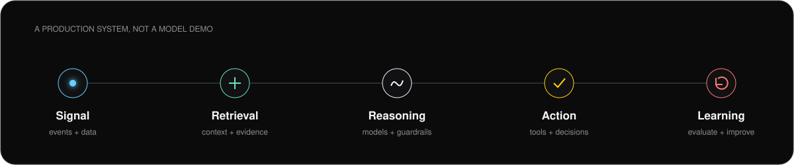

<p align="center">
  
</p>

<p align="center">
  <a href="https://dinesh-dhanoki.vercel.app/"></a>
  <a href="https://www.linkedin.com/in/dinesh-dhanoki/"></a>
  <a href="mailto:dineshdhanoki@gmail.com"></a>
  
</p>

## Building intelligence that ships

I am a **Senior AI Engineer** working at the intersection of applied machine learning, retrieval systems, data engineering, and product delivery. At **Claris, an Apple company**, I build dependable AI capabilities that turn complex data into clear decisions and useful customer experiences.

My work spans the complete production path: framing the problem, preparing data, designing retrieval and model workflows, evaluating quality, deploying services, and observing what happens after launch.

<table>
  <tr>
    <td width="33%" valign="top">
      <strong>Production AI</strong><br/><br/>
      Model-serving workflows, evaluation, guardrails, monitoring, and reliable integrations built for real users.
    </td>
    <td width="33%" valign="top">
      <strong>RAG &amp; Search</strong><br/><br/>
      Ingestion, chunking, embeddings, hybrid retrieval, reranking, citations, and grounded generation.
    </td>
    <td width="33%" valign="top">
      <strong>Data Intelligence</strong><br/><br/>
      ETL pipelines, analytics systems, experimentation, and decision tools that connect models to business outcomes.
    </td>
  </tr>
</table>

<p align="center">
  
</p>

## Engineering toolkit

**AI & machine learning**


**Data & platform**


**Product engineering**


## What I optimize for

```text
useful over theatrical       reliable over fragile
measured over assumed        simple over accidental complexity
secure by design             owned from prototype to production
```

## Current focus

- Building grounded, observable RAG systems with stronger retrieval and evaluation loops.
- Productionizing ML and LLM workflows through resilient APIs, automation, and monitoring.
- Turning analytics foundations into intelligent product experiences and business decisions.
- Contributing practical fixes and documentation to open-source AI projects.

## Selected work

| Project | What it demonstrates |
| --- | --- |
| [Portfolio](https://dinesh-dhanoki.vercel.app/) | Motion-led personal experience built with responsive, accessible frontend engineering. |
| [AURA WHEY](https://github.com/DineshDhanoki/AURA-WHEY) | Production e-commerce engineering across storefront UX, APIs, automation, and deployment. |
| [Open-source AI](https://github.com/DineshDhanoki?tab=repositories&q=&type=fork) | RAG retrieval improvements, reconciliation quality, AI engineering documentation, and collaborative delivery. |

## Engineering activity

<p align="center">
  
  
</p>

<p align="center">
  
</p>

---

<p align="center">
  <strong>Thoughtful systems. Measurable outcomes. Technology that earns trust.</strong><br/><br/>
  <a href="mailto:dineshdhanoki@gmail.com">dineshdhanoki@gmail.com</a>
  &nbsp;&middot;&nbsp;
  <a href="https://www.linkedin.com/in/dinesh-dhanoki/">LinkedIn</a>
  &nbsp;&middot;&nbsp;
  <a href="https://dinesh-dhanoki.vercel.app/">Portfolio</a>
</p>
